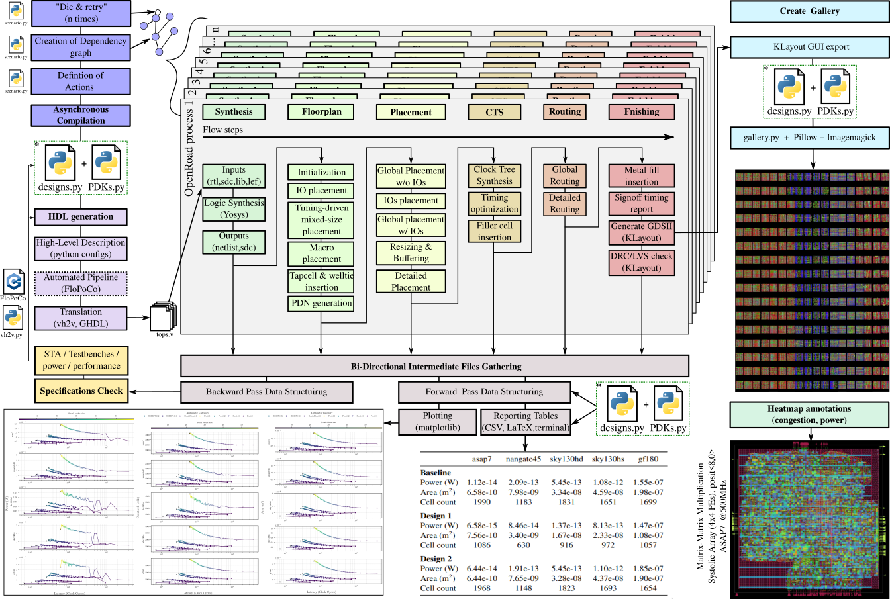
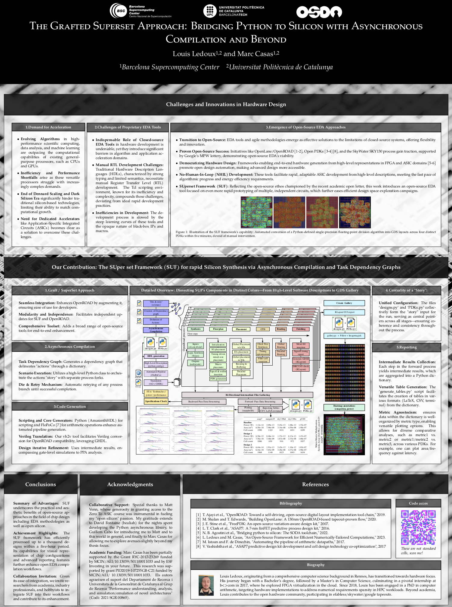

# SUF

**SUF** is a Superset Framework for [OpenROAD](https://github.com/The-OpenROAD-Project) that acts as an enhancement graft by augmenting the original capabilities. This repository and documentation are works in progress (WIP), especially as I will soon provide example scripts to demonstrate the capabilities of this framework with multi-parallel PDK compilation.

## Table of Contents
- [Overview](#overview)
  - [TL;DR](#tldr)
  - [Graphically Speaking](#graphically-speaking)
  - [Organization Hierarchy](#organization-hierarchy)
- [Installation Instructions](#installation-instructions)
- [How Does It Work?](#how-does-it-work-)
- [Poster Presentation](#poster-presentation)
  - [Poster Preview](#poster-preview)
  - [How to Cite](#how-to-cite)
- [How to Contribute?](#how-to-contribute)
  - [Pull Requests](#pull-requests)
- [License](#license)
- [Authors](#authors)

## Overview

### TL;DR
Are you interested by OpenROAD or the evolving domain of modern, open-source, rapid EDA tools for silicon design?
This project operates as an enhancement graft that augments OpenROAD's capabilities.
By cloning this repository, you will obtain both OpenROAD and a suite of Python tools adept at managing the process from input generation to generating detailed output plots in a parallel fashion.
For a swift overview after cloning and setting up, as detailed in the subsequent sections, a user can engage with the available commands/scripts as follows:
1. Clone the repository.
2. Install as per the instructions below.
3. `cd graft_road/` to browse its structure.
4. `ls -la` to examine the file organization.
5. `. ./venv/bin activate` activate virtual environment
6. `cd tools`
7. `./run_example` to generate HDL for various designs with different PDKs and initiate the OpenROAD flow concurrently.
8. `./plot_example` to reveal the plotting capabilities.

### Graphically Speaking
Overall, SUF framework is best represented with the following Figure


### Organization Hierarchy

file hierachy with explanations


## Installation Instructions

The `graft_road` directory contains the necessary submodules for translation tools. To clone `graft_road` and its submodules, use the following commands:

```bash
git clone --recurse-submodules https://github.com/Bynaryman/SUF.git
cd SUF/graft_road/translation_tools
```

## How does it work ?

The main initial feature is the parallel and asynchronous nature of SUF. With a class named scenario (located at ..) that relies on python async facilities, and a graph describing actions and their interdependencies, the execution is made through several threads and waits for the results and orchetrate next tasks lunching several OpenROAD flows in parallel to a certain controllable amount. When finished up to a certain point in the compilation flow, this graph still has the information of all designs and one last action thread can gather data to plot them.

## Poster Presentation

We had the opportunity to present our work at the 2024 4th Workshop on Open-Source Design Automation (OSDA), alongside the highly regarded International Conference on Design, Automation and Test in Europe (DATE). This event took place on March 25, 2024, at the Palacio De Congresos Valencia (Valencia Conference Centre - VCC) in Valencia, Spain. Below, you'll find the details of our presentation, including a preview of the associated poster and guidelines for academic citation.

### Poster Preview



### How to Cite

For those interested in citing this work in academic studies, please use the following BibTeX entry:

```bibtex
@inproceedings{LedouxCasas2024,
  title={The Grafted Superset Approach: Bridging Python to Silicon with Asynchronous Compilation and Beyond},
  author={Louis Ledoux and Marc Casas},
  booktitle={2024 4th Workshop on Open-Source Design Automation (OSDA), hosted at the International Conference on Design, Automation and Test in Europe Conference (DATE)},
  venue={Palacio De Congresos Valencia (Valencia Conference Centre - VCC), Valencia, Spain},
  date={March 25, 2024},
  year={2024},
  organization={OSDA},
  note={Available online soon.}
}
```

Or in text:

Louis Ledoux and Marc Casas. (2024). The Grafted Superset Approach: Bridging Python to Silicon with Asynchronous Compilation and Beyond. Presented at the 2024 4th Workshop on Open-Source Design Automation (OSDA), International Conference on Design, Automation and Test in Europe (DATE), March 25, Valencia, Spain. Available online soon.

## Authors
- Me / Bynaryman / Louis Ledoux [@Bynaryman](https://github.com/Bynaryman)
- Marc Casas [@Marccg1](https://github.com/Marccg1)

 ## How to Contribute?

We're excited you're interested in contributing to our project! Here are a few ways you can help:

- **If you plan to use it**, please don't hesitate to email us. Your insights and feedback can help us improve.
- **If you've used it**, we would greatly appreciate a mention or citation. It helps spread the word and recognize our efforts.

For those interested in direct code contributions, here's how you can get started:

### Pull Requests

We're open to pull requests! If you have a feature enhancement, a bug fix, or new functionality you'd like to add, please follow these guidelines:

1. **Fork the Repository** - Begin by clicking the "Fork" button at the top-right of this page. This creates your own copy of this project in your GitHub account.

2. **Clone the Repository** - Navigate to your GitHub profile, find the forked repository, click on the "Code" button, then click the "Copy to clipboard" icon. Use the following command in your terminal to clone the repository:

```
git clone "url you just copied"
```

3. **Create a New Branch** - Once you've navigated to the repository directory on your computer, it's time to create a new branch. This keeps your changes organized and separate from the main branch:

```
cd repository-name
git checkout -b your-new-branch-name
```

4. **Make Necessary Changes and Commit Them** - With your new branch ready, you can start making changes or additions to the project. Once you're done, add these changes to your local repository using:

```
git add .
git commit -m "Brief description of your contribution"
```

5. **Push Changes to GitHub** - After committing your changes, you're ready to push them to your forked repository on GitHub. This is done with the following command:

```
git push origin <your-branch-name>
```

By following these steps, you're well on your way to contributing to the project. We're thrilled to see what improvements and innovations you bring to the table. Thank you for considering contributing to our project!

## License
Academic Free License (“AFL”) v. 3.0
